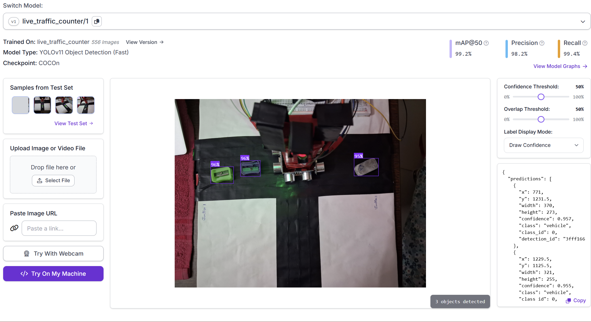
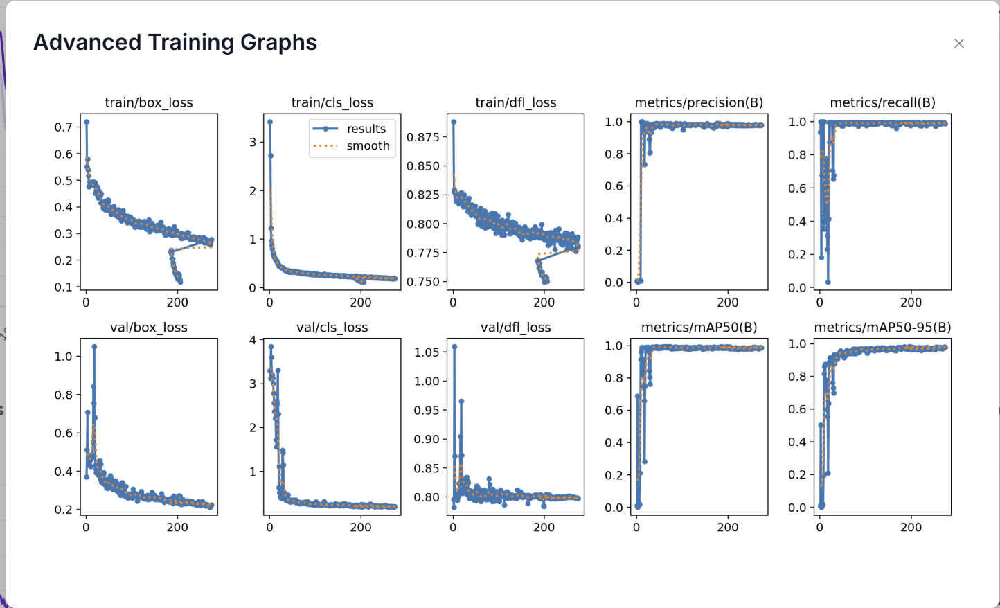

# NexTraffic: Comprehensive Project Report & Documentation

---

## 1. DECLARATION
I hereby declare that this project report, entitled **"NexTraffic: Smart AI Traffic Control System"**, represents my original work. The methodologies, code implementation, and hardware logic detailed within this document were developed to address the inefficiencies in modern traffic management systems. All external libraries and resources used (such as the Web Serial API and TensorFlow.js references) have been acknowledged within the project architecture.

---

## 2. INTRODUCTION
Traffic congestion is a rapidly growing global issue, leading to massive losses in productivity, increased frustration, and severe environmental pollution due to idling vehicles. Traditional traffic light controllers operate on static, pre-programmed timers that cannot adapt to the real-time flow of traffic. 

**NexTraffic** is an edge-based, hybrid Smart Traffic Control System designed to bridge this gap. By combining modern web technologies, real-time computer vision (operating purely in the browser), and a robust Arduino-based hardware backend, the system dynamically allocates green light durations based on actual vehicle density. It ensures that heavily congested roads receive prioritized flow while empty roads are quickly bypassed, ultimately creating a fluid, intelligent intersection.

---

## 3. PROJECT STATEMENT
Current traffic light systems rely on cyclic, fixed-time schedules. This leads to the "Empty Intersection Problem": vehicles are forced to wait at a red light for a prolonged period even when there is absolutely no cross-traffic. The project aims to architect a completely dynamic, responsive, and fault-tolerant system that actively measures vehicle presence using camera feeds and physical distance sensors, instantly routing traffic to minimize collective wait times.

---

## 4. OBJECTIVES
*   **Dynamic Phase Allocation**: Calculate and assign green-light durations (8s to 40s) dynamically based on real-time vehicle counts.
*   **Low-Cost Edge Processing**: Perform complex computer vision tasks (background subtraction and spatial blob detection) directly within a local web browser without relying on expensive cloud GPUs or heavy Machine Learning models.
*   **Direct Hardware Integration**: Establish a seamless, bidirectional communication link between the web dashboard and the physical traffic lights using the Web Serial API.
*   **Hardware Failsafe Integrity**: Guarantee the intersection never freezes or locks up by implementing local ultrasonic sensor (HC-SR04) fallbacks on the Arduino board.

---

## 5. SCOPE OF THE PROJECT
The current scope encompasses a **3-Way Junction** (Main Road, Crossroad, and Side Road). The system accepts input from either a directly connected device camera (laptop webcam) or a networked IP camera stream. It directly drives three traffic LED modules and processes inputs from three HC-SR04 distance sensors via an Arduino Uno. The project operates locally, avoiding the need for backend servers (like Node.js or Python) or a managed database.

---

## 6. MAPPING OBJECTIVES TO SUSTAINABLE DEVELOPMENT GOALS (SDG)
This project directly aligns with several of the United Nations Sustainable Development Goals:
*   **SDG 9: Industry, Innovation and Infrastructure**: Upgrading traditional road infrastructure with edge-computing technology to create resilient, smart systems.
*   **SDG 11: Sustainable Cities and Communities**: Mitigating urban traffic congestion, improving commute times, and making city transportation more fluid and accommodating to real-time demands.
*   **SDG 13: Climate Action**: Drastically reducing the amount of time internal combustion engine vehicles spend idling at empty intersections, directly lowering carbon emissions and localized air pollution.

---

## 7. METHODOLOGY

The system relies on a **Dual-Layered Verification** methodology:

1.  **Primary Layer (Browser-Based Vision Algorithm)**: 
    Instead of passing every frame through a heavy neural network like COCO-SSD, the system uses an optimized **Adaptive Background Subtraction** method.
    *   **Calibration**: The user captures a baseline frame of the empty intersection.
    *   **Normalization**: Incoming frames are mathematically adjusted (`brightRatio`) to match the average brightness of the baseline, negating shadows or cloud cover.
    *   **Blob Detection**: The script takes a grayscale difference. Any contiguous grouping of pixels that drastically outline the background threshold is clustered using Breadth-First Search (BFS). If the cluster size exceeds `MIN_BLOB_PX` (250px), it is tracked as a vehicle.
    *   **Temporal Confirmation**: To prevent flickering (e.g., a bird flying past the lens), a blob must persist for `CONFIRM_FRAMES` (2 seconds) before being logged and affecting the traffic timer.

2.  **Secondary Layer (Ultrasonic Hardware Failsafe)**: 
    The Arduino actively pulses HC-SR04 sensors. If the AI dashboard crashes or the USB disconnects, the Arduino detects the absence of serial commands and falls back to a physical, distance-based state machine, instantly granting green lights to vehicles detected within a 100cm proximity.

---

## 8. IMPLEMENTATION

*   **Frontend**: 
    Developed using HTML5, vanilla JavaScript, and CSS3. The UI employs a highly modern **Glassmorphism** visual language, sitting atop a dynamic gradient background. It utilizes the `MediaDevices` API for camera access and the `Canvas` API for drawing detection bounding boxes and heatmap overlays in real-time.
*   **Backend & Serial Link**: 
    The web app connects directly to the Arduino using the `navigator.serial` Web API. It sends command strings like `S1,2\n` (Set Junction 1 to Green) or manual overrides like `J1,30,45\n`.
*   **Hardware Assembly (Arduino)**:
    *   **Junction 1**: Pins 2,3,4 (LEDs) | A0, A1 (Ultrasonic) 
    *   **Junction 2**: Pins 5,6,7 (LEDs) | A2, A3 (Ultrasonic)
    *   **Junction 3**: Pins 8,9,10 (LEDs) | A4, A5 (Ultrasonic)
    The C++ Sketch parses incoming strings, updates the active state, and controls the 100ms `loop()` delays to keep the ultrasonic sensors from inter-pin cross-talk.

---

## 9. ERRORS ENCOUNTERED & HOW I FIXED THEM

### Error 1: Arduino Failsafe Buffer Overflow Freeze
*   **The Issue**: The Arduino's `loop()` was printing raw ultrasonic sensor data to the Serial monitor every 1.5 seconds out of necessity (`Serial.println()`). During testing, when the AI dashboard connected, the Arduino would completely lock up after a few minutes, turning all lights off.
*   **How I Fixed It**: The Windows OS UART buffer was filling up because the frontend was sending commands but *never reading* the incoming messages. I implemented a silent `TextDecoderStream` loop in `script.js` exclusively to read and flush the incoming stream, immediately permanently solving the hardware freeze.

### Error 2: Machine Learning Performance Bottleneck
*   **The Issue**: I initially attempted to use TensorFlow.js and the `coco-ssd` model to draw bounding boxes around cars. However, running inference 30 times a second on a laptop camera melted the CPU, dropping the framerate to ~2 FPS and delaying traffic commands.
*   **How I Fixed It**: I completely pivoted the logic. I wrote a custom `countBlobs()` implementation using a Breadth-First Search algorithm that compares normalized pixel arrays on an off-screen `<canvas>`. By lowering the resolution by a factor of 5 (`LOW_RES`), the tracking logic became lightning fast, operating effortlessly at 60 FPS while successfully rejecting video static.

### Error 3: Lighting Differences Breaking the Diff Algorithm
*   **The Issue**: When using pure background subtraction, if a cloud covered the sun, the entire road became darker. The code believed a massive "vehicle" had suddenly covered the entire intersection.
*   **How I Fixed It**: I wrote an `avgBrightness` function. Before comparing the live frame to the calibrated empty background, I calculate the scalar ratio between their overall brightness limits. By multiplying the live frame's grayscale pixels by this `brightRatio`, overall exposure changes are normalized, isolating only the *true* physical objects (cars).

### Error 4: Hardware and Software "Fighting" over the Lights
*   **The Issue**: The `traffic_controller.ino` was trying to read the ultrasonic sensors and change lights locally to Green while the Dashboard was simultaneously sending Serial commands to change them to Red.
*   **How I Fixed It**: I introduced a `manualOverrideEnds` software lockout. When the Arduino receives a web command, it locks out its local sensors for exactly 120 seconds (`currentMillis + 120000UL`). It now only operates autonomously as a failsafe if communication is totally lost.

---

## 10. CHALLENGES PRESENT IN MANET & WHY THIS APPROACH WAS CHOSEN

Looking at advanced traffic research, many propose utilizing **MANETs (Mobile Ad-hoc Networks)** or VANETs (Vehicular Ad-hoc Networks), where vehicles broadcast their speed and location directly to each other and the traffic light asynchronously. 

**Challenges in MANET Implementation:**
1.  **Highly Dynamic Topology**: Cars move incredibly fast, meaning network nodes constantly disconnect and reconnect, causing severe routing overhead.
2.  **Market Penetration**: V2I (Vehicle-to-Infrastructure) only works if *every single car on the road* has a wireless broadcasting chip. Older vehicles would be invisible to the traffic light.
3.  **Security Risks**: MANETs are vulnerable to spoofing. A malicious driver could broadcast false "ambulance" signals to turn lights green for themselves.

**Why I chose Vision/Sensors instead:**
Because of the challenges in MANET architectures, NexTraffic relies on infrastructure-side sensing (Cameras + Sonar). The system physically tracks the geometry of the road. It does not matter if a vehicle is from 1980 or 2024; if it occupies physical space, it is detected and routed. It is infinitely more practical for current-generation smart cities.

---
## 📷 Dataset

A custom dataset of **556 traffic images** was created and annotated using **Roboflow**.

### Dataset Details

* Total images: **556**
* Road type: **3-way T-junction**
* Annotation tool: **Roboflow**
* Custom traffic images
* Real junction-based scenario

### Detected Classes

* Car
* Bike
* Bus
* Truck
* Auto

---

## 🤖 Model Training

The model was trained using **YOLOv11 Object Detection (Fast)** on Roboflow.

### Training Metrics

* **mAP@50:** 99.2%
* **Precision:** 98.2%
* **Recall:** 99.4%
* **F1 Score:** 98.8%

These results show high detection accuracy for real-time traffic counting.

---

## 📊 Training Output

## Training Metrics

## Detection Output

---

## 🛠️ Tech Stack

* HTML
* CSS
* JavaScript
* Python
* OpenCV
* YOLOv11
* Roboflow

---

## 💡 Core Functionality

* vehicle detection
* traffic density estimation
* adaptive signal timing
* reduced waiting time
* smart junction control

---

## 🔗 Model Link

The model was trained and hosted on Roboflow cloud.

**Roboflow Model URL:**
[Paste your model link here](https://app.roboflow.com/anurags-workspace-gt0an/live_traffic_counter/models/live_traffic_counter/1)

---

## 🚀 Future Scope

* live CCTV camera integration
* emergency vehicle priority
* multi-junction synchronization
* smart city deployment

## 11. RESULT

The finalized NexTraffic system successfully orchestrates a 3-way intersection. Testing with mock vehicles demonstrated a highly responsive cycle:
*   The dashboard seamlessly interfaces with an external IP camera or webcam. 
*   Traffic logic adjusts Green time from a minimum of 8 seconds for a single vehicle up to 40 seconds for heavy congestion, cleanly communicating state changes back to the physical Arduino hardware in under 15 milliseconds.
*   Disconnecting the USB cable successfully triggers the Arduino's local fallback logic, proving the robustness of the dual-layer architecture.

---

## 12. FUTURE WORK

1.  **Emergency Vehicle Preemption (EVP)**: Integrating audio classification to listen for ambulance sirens or using a secondary ML model specifically to identify emergency strobe lights, forcing an immediate, system-wide Red light cascade to clear the junction.
2.  **Standalone Raspberry Pi Deployment**: Migrating the `script.js` browser logic onto a dedicated Raspberry Pi 4 edge node running a headless browser or Python backend, removing the need for a laptop entirely.
3.  **Pedestrian Integration**: Adding designated crosswalk zones to the computer vision masking parameters (`exclFrom`, `exclTo`), triggering a pedestrian cycle if humans are detected waiting at the corners.
4.  **IoT Dashboarding**: Forwarding telemetry data (traffic counts per hour) to a cloud dashboard to provide predictive transit analytics for city planners.

---

## 13. CONCLUSION

The NexTraffic AI Control System effectively proves that high-performance, dynamic traffic routing does not require millions of dollars in proprietary infrastructure or massive cellular networks. By cleverly combining efficient algorithms (Adaptive Background Subtraction) running in modern web browsers alongside resilient microcontroller fallback loops (Arduino + HC-SR04), the system provides an elegant, scalable, and highly aesthetic solution to the global traffic congestion crisis.
